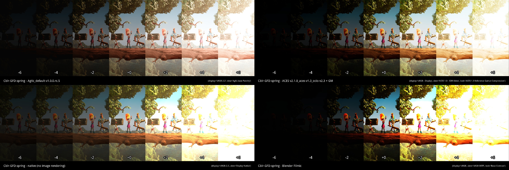
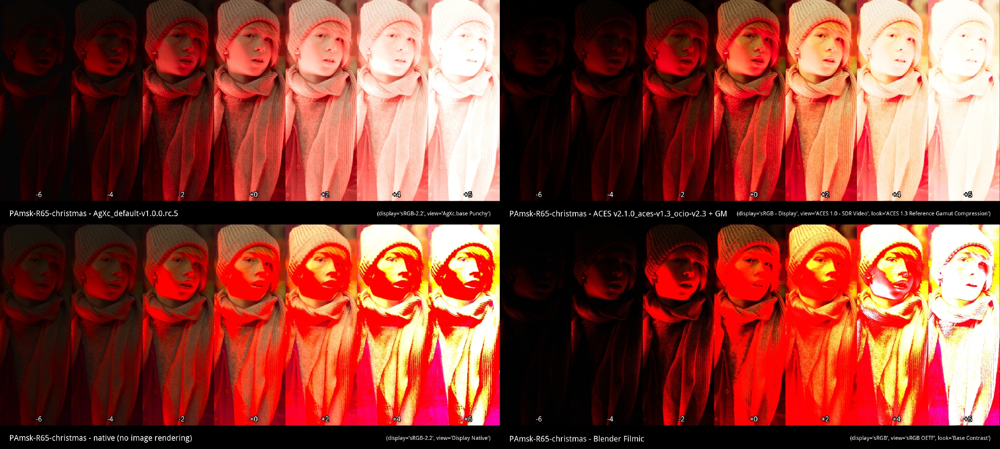
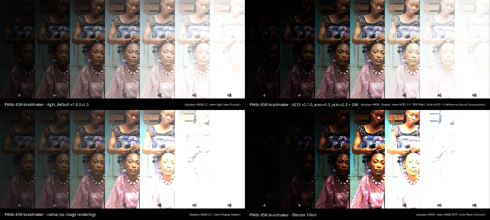
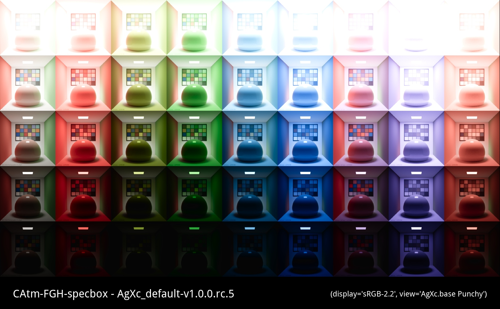
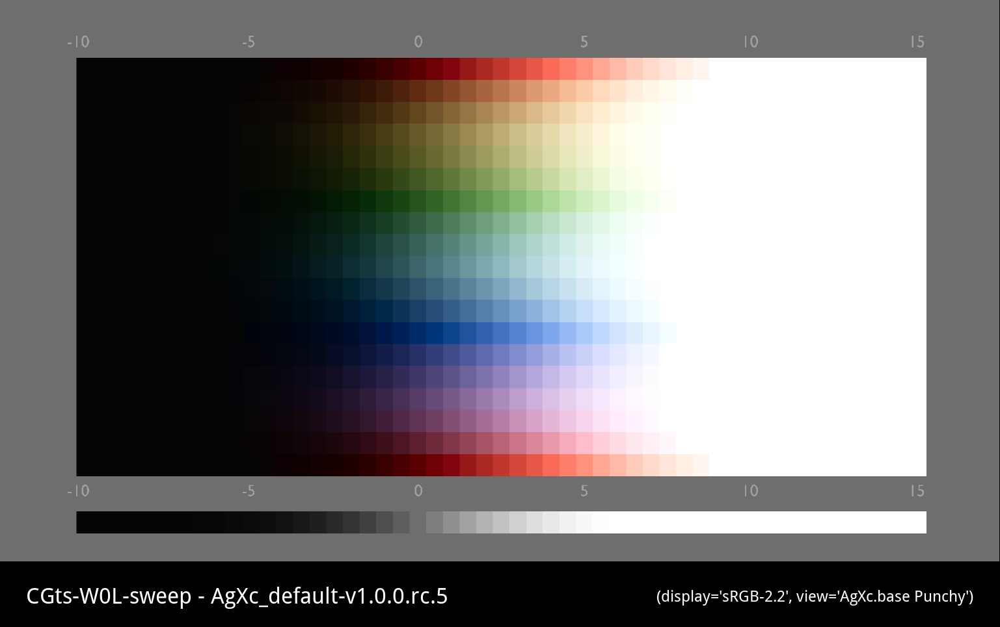

# gallery

Test images to visualize and compare results of AgXc rendering.

Original images can be found in [assets](.dev/assets) directory. Original author
and additional information can be found in the side-car json file.

All sources images are processed using an automatized process stored in 
[doc-imagegen.py](.dev/implementations/doc/scripts/doc-imagegen.py). The process
is using the [ocio](ocio) implementation to render the images.

## [CAlc-D8T-dragon](doc/images/CAlc-D8T-dragon)

## [Cblr-GFD-spring](doc/images/Cblr-GFD-spring)

## [PAmsk-R65-christmas](doc/images/PAmsk-R65-christmas)

## [PWdc-85R-braidmaker](doc/images/PWdc-85R-braidmaker)

## [CAtm-FGH-specbox](doc/images/CAtm-FGH-specbox)

## [CGts-W0L-sweep](doc/images/CGts-W0L-sweep)

