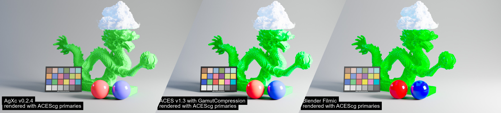
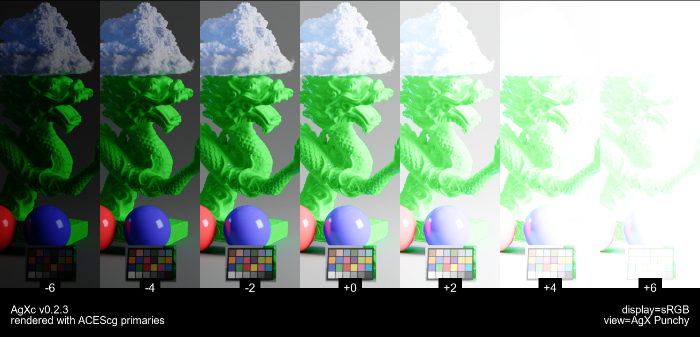

"Fork" of Troy Sobotka's AgX https://github.com/sobotka/AgX with implementation
in various languages/software.

AgX is a [display rendering transform](https://github.com/jedypod/open-display-transform/wiki/doc-introduction)
(DRT) with the goal of improving image formation.

It tries to provide a ""neutral look"" via a robust but simple image formation process.

The result can be comparable to the analog film process with noticeable soft highlight rollof,
smooth color transitions and pleasing exposure handling.

If you find that there was too much scary-looking words until now, just
consider AgX as a "LUT".

Exposure stripes increment (in stops units) tests:

| [AgXc](./doc/images/dragon.exposure-stripes.AgXc.jpg) | [ACES](./doc/images/dragon.exposure-stripes.ACES1.3-GM.jpg) | [Filmic](./doc/images/dragon.exposure-stripes.filmic.jpg) | [TCAM](./doc/images/dragon.exposure-stripes.TCAMv2.jpg) | [Native](./doc/images/dragon.exposure-stripes.native.jpg) |
|-------------------------------------------------------|-------------------------------------------------------------|-----------------------------------------------------------|---------------------------------------------------------|-----------------------------------------------------------|

# Background

The AgX formula used is based on the original Troy's implementation which is 
not the same as what is currently being implemented in Blender-4+ (which could
be considered better).

- assume sRGB working space
- clip everything outside
- apply traditional log2 encoding
- apply "inset" (gamut reshaping)
- apply tonescale (1D curve)
- display EOTF

It is possible the various implementations in this repository are not at the same level
of progress. For example the LUT implementation is already using a BT.2020 workspace approach
(like the Blender version).

# Content

The simplicity of AgX allowed to port it to various languages and software:

- [OpenColorIO](ocio) : compatible with v1 API
- [ReShade](reshade) : for in-game use.
- [OBS](obs) : to apply on live camera feed.
- [Python](python) : numpy-only script and a more advanced library for manipulation.
- [nuke](nuke): partial implementation for [Foundry's Nuke](https://www.foundry.com/products/nuke-family/nuke)
- [luts](luts): LUTs file for preview in various systems

> screenshot from game Stray with AgX applied via ReShade

> Screenshot of the OBS interface while streaming 8Bit VLog from a Panasonic camera.

# Usage

Consider each directory in this repository to be its own independent software.
Usually each have its own versioning, changelog and documentation.

When any of the implementation has a new version I bump the global version
of this repo in the [pyproject.toml](pyproject.toml) and make a new GitHub release.
