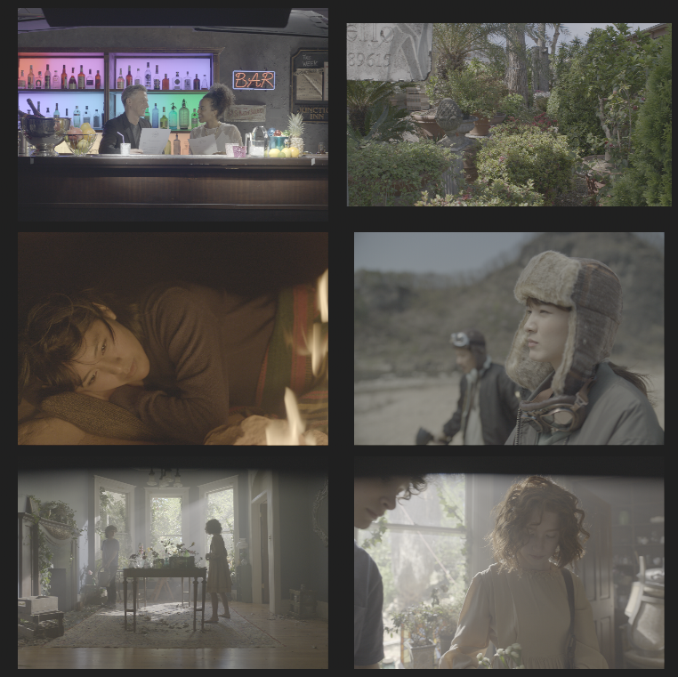
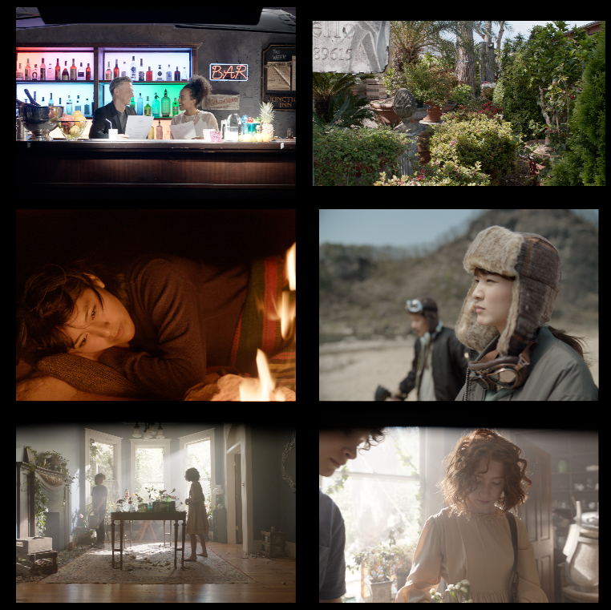
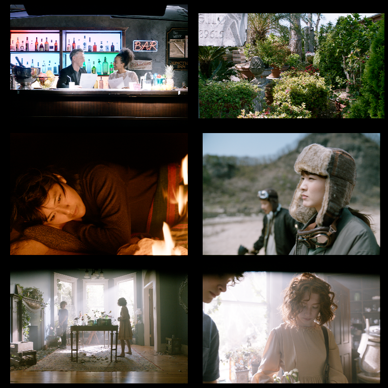
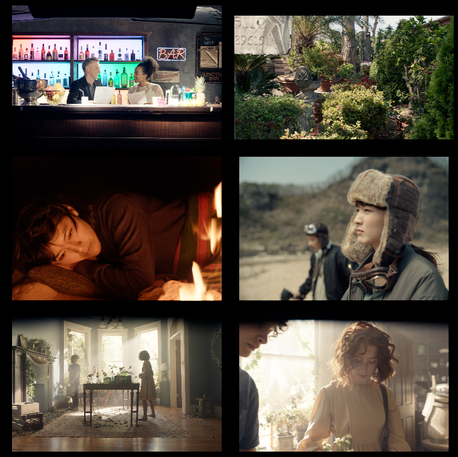

# VLog

LUTs for Panasonic camera with VLog encoding.
"VLog" assume V-Gamut + VLog transfer-function.

There are BT709 and BT1886 variants just in case but after using [this
image](https://community.acescentral.com/t/srgb-piece-wise-eotf-vs-pure-gamma/4024/8?u=mrlixm)
imported on my camera (S5IIx) I was able to confirm the monitor and viewfinder are sRGB.

# looks

Apart from look1 which is "default" AgX, teh other looks are mostly considered
experimental.

> ^ VLog input encoding

> ^ look1 which is just AgX without grading

> ^ look2

> ^ look3

# notes

Look were generated in nuke for faster iteration and then reproduced in python.