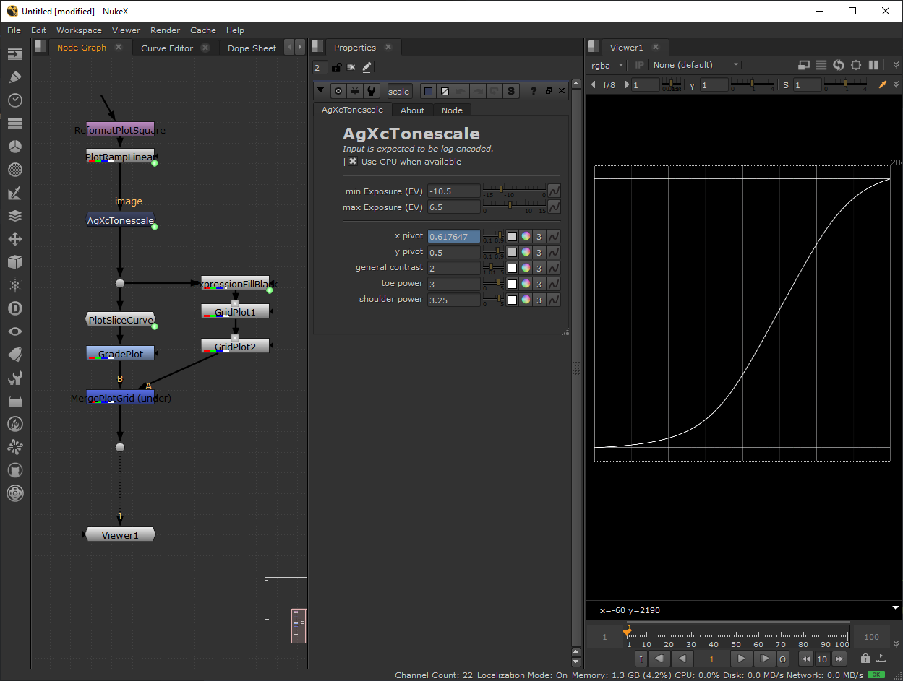
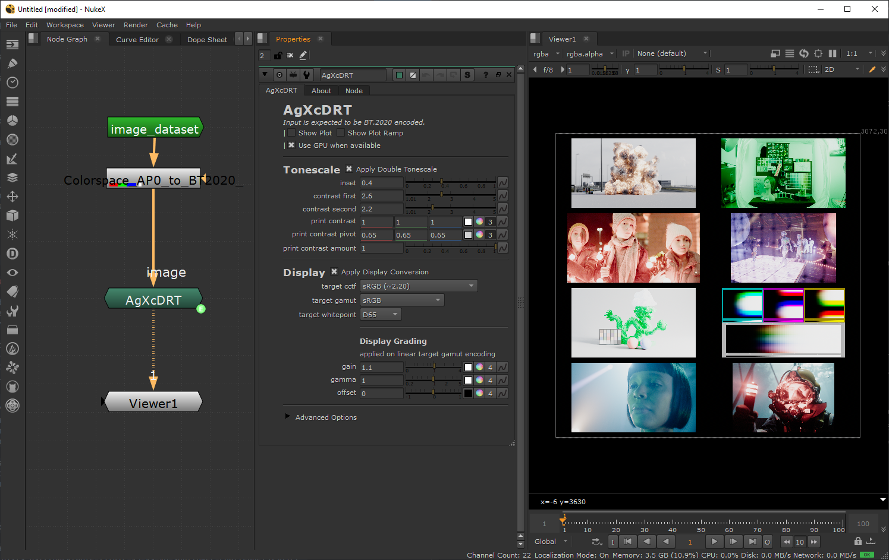
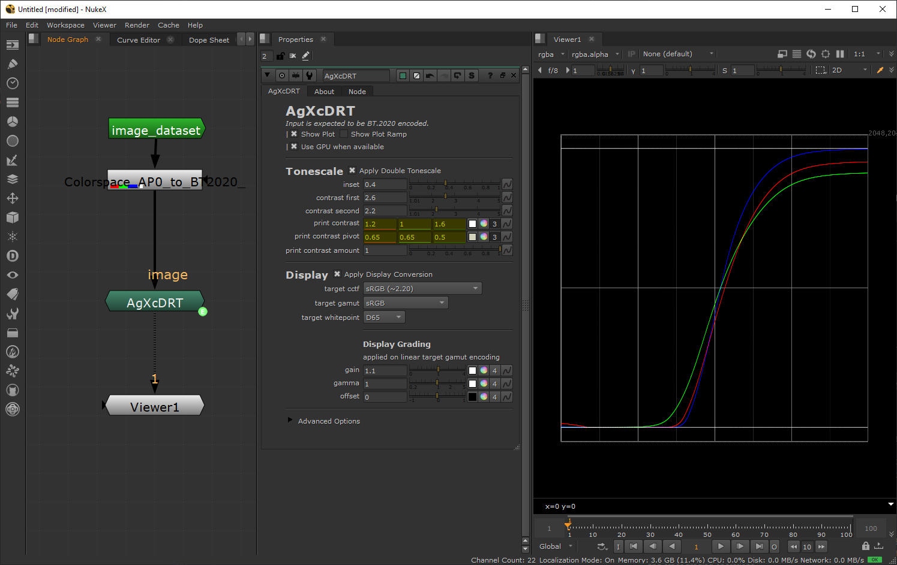

# AgXc/nuke

Nuke native implementations of AgX.

# Content

| tool                                                                                                      | description                                      |
|-----------------------------------------------------------------------------------------------------------|--------------------------------------------------|
| [AgXcTonescale.nk](AgXcTonescale.nk)                                                                      | tonescale algorithm of AgX (blink script based). |
| [AgXcDRT.nk](AgXcDRT.nk)                                                                                  | full image rendering pipeline for AgX            |
| [PrimariesInset](https://github.com/MrLixm/Foundry_Nuke/blob/main/src/primaries_inset) (in external repo) | gamut remapping algorithm, referred as "inset"   |


# Instructions

## installation

Common for all tools :

- Open the desired `.nk` file in GitHub or download it locally
- Copy to clipboard the whole content of the nk file
- Paste into any opened Nuke scene

## requirements

As of right now all tools are independent of each others and don't have external dependencies.

* Tools were developed for Nuke15 but MIGHT work on lower versions.
* Tools were developed on Windows but SHOULD work on other platforms.
* Tools use the following nuke features :
  * blink script (compatible with non-commercial version >= 14.0)
  * python for some internal components but static (i.e only triggered on user press)


## `AgXcTonescale.nk`

The tonescale is the per-channel "s-curve" algorithm that is remapping the luminance
range of its input data.

The algorithm is the same as per originally defined by Troy:
https://github.com/sobotka/AgX-S2O3/blob/daffcfa18edaa7172ce549cd25e80b7faadd8292/AgX.py#L192


> PlotSlice node by Jed Smith

### input/output

The tonescale expect log-encoded data as input. 

### pivot

The initial formula to calcule the x and y pivot specified by Troy was:

```python
min_EV = -10
max_EV = +6.5
x_pivot = abs(min_EV / (max_EV - min_EV))
# >>> x_pivot = 0.6060606
y_pivot = 0.50
```

## `AgXcDRT.nk`

Encode "open-domain" data to display.

Algorithm is based on the original Troy implementation with various additions,
some personal, some from other AgX tinkerers (see credits).

For a full breakdown see my post on [Blender-Artist AgX thread.](https://blenderartists.org/t/feedback-development-filmic-baby-step-to-a-v2/1361663/2316)



### input/output

Expect "open domain" data as input, with a `linear BT.2020 D65` encoding.

Output a display-referred result bounds to the specified display that can be directly
previewed or written to disk without any more processing (_example: make sure
the nuke view-transform is disabled when viewing its output_).

### plot

It is possible to visualize a 2D "slice" plot of the process by checking "Show Plot".
A linear 0-1 ramp is being plotted and allow to visualize the effect of the tonescale
and other grading operations.

* The y axis is in [0-1] range and represent pixel "intensity".
* The x axis is a 2D slice of the ramp where lower values represent dark values
of the input and high values the white ones.




### purity

#### luminance compensation

A personal "trick" to reduce purity in gamut boundaries values.

The algorithm is as follows :

1. find luma using R-G-B weights computed from colorspace primaries and whitepoint
2. extract chroma by dividing luma
3. apply +1 offset on chroma
4. apply 0.5 power on chroma
5. apply 0.25 gain on luma to compensate for chroma change
6. multiplying back chroma with luma to recombine image
7. lerping 6. with luma calculated in 1. to only apply changes on higher values


#### inset

Control the amount of chroma purity in bright values where higher values will
produce a less chroma-intense look.

The default value of 0.4 might be a bit strong.

#### purity amount

Apply the invert inset operation called outset (the inset being a 3x3 matrix 
this is just the matrix inverted) and control how much is applied.

The outset retrieve purity in midtones and shadows but reintroduce skews and
artefacts.

Note the outset is applied after teh first tonescale meaning you can play with
the second inset to compensate for its artefact.


### tonescale

"Luminance mapping" of the image with additional grading possibilities to emulate
the color-shift of the analog film print process. Note the process MIGHT actually
have no similarity at all with the film print process but the name was found to be pertinent
and stayed, in lack of better term.

Original AgX implementation applied the tonescale a single time. This one can apply
it 2 times, producing an extra softness that can be comparable to the look
of analog film.

#### contrast

Control the contrast of the 2 tonescale curves. It is interesting to see them
as working in tandem.

The `contrast second` only works when `Apply Double Tonescale` is of course checked .

#### print contrast

The tonescale section offer a creative control called "print contrast" that allow
to shift the tones of your image. The intended use is to use different R-G-B ratios
on the `print contrast` control, with the additional pivot control to refine further
the look (do not hesitate to check `Show Plot` to have an alternative representation
of your changes).

The pivot correspond to the center of the "S curve" and a value of 0.18 map to
scene-linear middle grey.


### display

Pick the target display the image should be intended to be displayed on.

The grade options help achieve an optimal rendering for that display.

# Developer

Check the [src/](src) directory.

# Credits

* Troy Sobotka: of course for the original AgX algorithm
* Jed Smith: [nuke-colortools](https://github.com/jedypod/nuke-colortools).
* flannelhead and other darktable developers: https://github.com/darktable-org/darktable/pull/15104
* EaryChow and anyone involved in the development of the Blender variant: https://blenderartists.org/t/feedback-development-filmic-baby-step-to-a-v2/1361663/