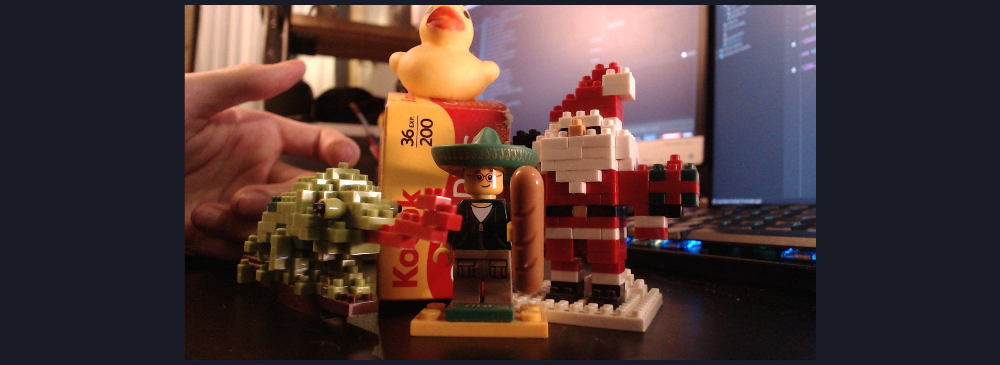
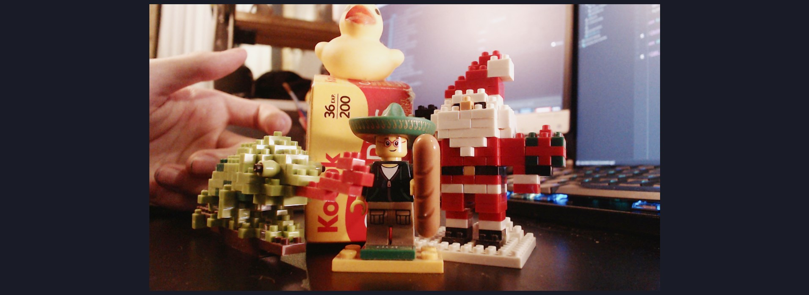

# obs

Implementation of AgX for [OBS](https://obsproject.com/) as a script.

This is mainly intended to be applied on live camera feeds as this would not have
many benefits applied on desktop capture.

| default rendering                                                                                                           | with AgX filter                                                                                                         |
|-----------------------------------------------------------------------------------------------------------------------------|-------------------------------------------------------------------------------------------------------------------------|
|  |  |

> video device is a "standard" Logitech C922 webcam for the above comparison

# Features

Colorspaces available as input and output :

| open-domain    | display-referred         | camera vendor             |
|----------------|--------------------------|---------------------------|
| sRGB Linear    | sRGB Display (EOTF)      | Cinema Gamut (Canon)      |
| BT.2020 Linear | sRGB Display (2.2)¹      | F-Gamut FLog (Fujifilm)   |
| DCI-P3 Linear  | BT.709 Display (2.4)     | F-Gamut FLog2 (Fujifilm)  |
| Passthrough²   | DCI-P3 Display (2.6)     | N-Gamut (Nikon)           |
|                | DCI-P3 D65 Display (2.6) | S-Gamut (Sony)            |
|                | DCI-P3 D60 Display (2.6) | S-Gamut2 (Sony)           |
|                | Apple Display P3         | S-Gamut3 (Sony)           |
|                | Adobe RGB 1998 Display   | S-Gamut3.Cine (Sony)      |
|                | BT.2020 Display (OETF)   | V-Gamut (Panasonic)       |

- ¹ parenthesis for display-referred colorspace indicate transfer-function characteristic. `2.2` being the power function.
- ² Means "no color-transformation applied"

Grading Options :

- Exposure
- Gamma
- Saturation
- Highlight Gain
- Highlight Gain Threshold
- White Balance Temperature
- White Balance Tint
- White Balance Intensity

All gradings options are available a "pre image-formation" (linear open-domain) and "post image-formation" (display-referred closed-domain).
Grading in "pre image-formation" is performed in a linear sRGB working space and "post image-formation" is performed in the Output colorspace selected.
  
# Requirements

- This has been developed on OBS `28.1.2` for Windows but should work for lower 
and upper versions, and other operating systems.

- Nothing more than the content of this directory.

# Installation

[Download](https://github.com/MrLixm/AgXc/archive/refs/heads/main.zip) this whole
GitHub repository.

Put the **whole** content of the [obs/obs-script](obs-script) directory 
anywhere you want on your system (you DON'T need the `src/` or the `doc/` directory).

1. Open OBS
2. In the top menu > Tools > Scripts
3. Click on the `+` button, and browse to the location of the `obs-script/AgX.lua` file.

The script is now active. A new filter has been created :

1. Go to your Scene/Source where you want to add the AgX filter and select it (the source)
2. Click on the `Filters` button that should be a bit above the source.
3. In the **Effect Filters** section, click the `+` button and choose `AgX`

All done ! You can now configure it.

# Configuration

> [!IMPORTANT]
> Reminder that AgX being a display transform it should be placed at
> **the very end** of the image processing chain (= at the bottom in OBS).

The camera/video-source and your lighting setup will affect how much you need
to tweak the parameters. There is no setup that work for all cases, but once
configured for your camera/usual lighting, you should not need to touch it anymore.

## Guidelines

I recommend to :
- `Pre-Grading`
  - boosting the `Grading Exposure` by +1.0 stop if you are in a dim environment.
  - boosting `Highligh Gain` by 2.0 (always better)
  - `White Balance`: `intensity` at 1.0 and use `tint` ~10.0 if your camera tend to
  have to produce pinkish tones (noticable on skin).

## Available Options

### Input Colorspace

Pick in which colorspace your source is encoded. 

`Passthrough` means no decoding is applied.

### Output Colorspace

Target colorspace encoding. Must correspond to your monitor calibration.

> [!TIP]
> You can request adding new colorspace by opening an issue on GitHub !

### DRT

Pick the DRT to use. Technically here we could include other DRT than AgX.
But for now only None and AgX (with 2 variants) are available.

- `None` will not apply AgX but still allow you to use the grading options.
- `AgX w/Outset` is AgX but with an additional transform to restore chroma. This
can reintroduce shift and skews but might be acceptable.

### Pre-Grading/...

Adjust imagery look in a linear space, before AgX is applied.

### Grading/Exposure

Exposure in stops. 0.0 = neutral.

### Grading/Gamma

Power function. 1.0 = neutral.

### Grading/Saturation

Saturation with coefficient based on the working color-space. 1.0 = neutral.

### Grading/Highlight Gain

Only boost the brightest part of the image. The range of those brightests part can be adjusted
via `Highlight Gain Threshold`.

0.0 = neutral.

### Grading/Highlight Gain Threshold

See above.

### Grading/White-Balance

Shift white tones, applied before all operations.

- `Temperature`: in Kelvin. Lower=warmer, higher=colder.
- `Tint`: shift the temperature: >0=greener, <0=pinker
- `Intensity`: global multiplier for the effect. 0=disabled.

The most "neutral values" when `Intensity` is 1.0 are `Temperature`=`~5600` and
`Tint`=`~-15.5` which try to match the Illuminant E (those neutral values are not 
ideal and perhaps the white-balance implementation could be improved)

### Post-Grading/...

Grading modifications applied after AgX on display encoded data. This will
introduce skews, clipping and other artefacts.

Not recommended to use or with very small values, but can help achieve a stronger
artistic look.

All parameters are described the same as for the Pre-Grading section.

### Debug/CAT Method

Chromatic Adaptation Transform method to chose for whitepoint conversion (when
there is a whitepoint conversion between input and output colorspace.)

Default is Bradford and doesn't need to be changed.

# Developer

Developer documentation can be found in [doc/DEV.md](doc/DEV.md).
