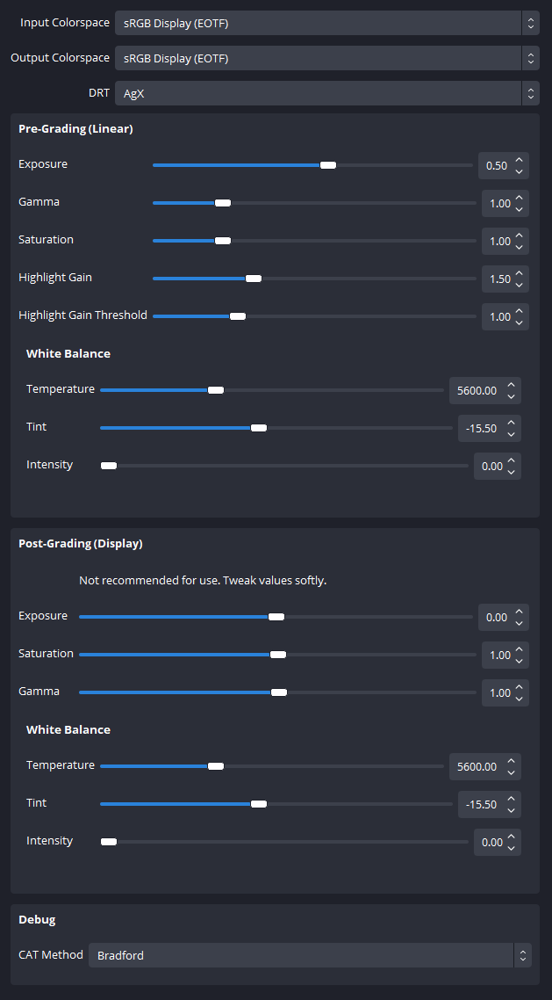

# obs

Implementation of AgX for [OBS](https://obsproject.com/) as a script.

This is mainly intended to be applied on live camera feeds as this would not have
many benefits applied on desktop capture.

| default rendering                                                                                                           | with AgX filter                                                                                                         |
|-----------------------------------------------------------------------------------------------------------------------------|-------------------------------------------------------------------------------------------------------------------------|
|  |  |

> video device is a "standard" Logitech C922 webcam

# Requirements

- This has been developed on OBS `28.1.2` for Windows but should work for lower 
versions, and other operating systems.

- Nothing more than the content of this directory.

# Installation

[Download](https://github.com/MrLixm/AgXc/archive/refs/heads/main.zip) this whole
GitHub repository.

Put the **whole** content of the [obs/obs-script](obs-script) directory 
anywhere you want on your system (you DON'T need the `src/` or the `doc/` directory).

1. Open OBS
2. In the top menu > Tools > Scripts
3. Click on the `+` button, and browse to the location of the `obs-script/AgX.lua` file.

The script is now active. A new filter has been created :

1. Go to your Scene/Source where you want to add the AgX filter and select it (the source)
2. Click on the `Filters` button that should be a bit above the source.
3. In the **Effect Filters** section, click the `+` button and choose AgX

All done ! You can now configure it.

# Configuration

> ![NOTE]
> Reminder that AgX being a display transform it should be placed at
> **the very end** of the image processing chain (= at the bottom in OBS).

The camera/video-source and your lighting setup will affect how much you need
to tweak the parameters. There is no setup that work for all cases, but once
configured for your camera/usual lighting, you should not need to touch it anymore.

## Recommended Options

I recommend to always start by :

- boosting the `Grading Exposure` by +1.0 stop.
- boosting `Highligh Gain` by 2.0

## Available Options

### Input Colorspace

Pick in which colorspace your source is encoded. 

Passthrough means no decoding is applied.

### Output Colorspace

Target colorspace encoding. Must correspond to your monitor calibration.

> ![NOTE]
> You can request adding new colorspace by opening an issue on GitHub !

### DRT

Pick the DRT to use. Technically here we could include other DRT than AgX.
But for now only None and AgX are available.

`None` will not apply AgX but still allow you to use the grading options. 

### Pre-Grading/...

Adjust imagery look in a linear space, before AgX is applied.

### Grading/Exposure

Exposure in stops. 0.0 = neutral.

### Grading/Gamma

Power function. 1.0 = neutral.

### Grading/Saturation

Saturation based on BT.709 coeff. 1.0 = neutral.

### Grading/Highlight Gain

Only boost the brightest part of the image. The range of those brightests part can be adjusted
via `Highlight Gain Threshold`.

0.0 = neutral.

### Grading/Highlight Gain Threshold

See above.

### Post-Grading/...

Grading modifications applied after AgX on display encoded data. This will
introduce skews, clipping and other artefacts.

Not recommended to use or with very small values.

### Debug/Use OCIO Log Transform

Switch to use the HLSL transform being an exact match to the OCIO `log2Transform`.

Does not create any change visually.

### Debug/Apply Outset

Not originally included in the first AgX version but should be in the future.
Restore chroma and avoid having to use Punchy saturation.
Might bring back some hue skews so better left off. 

### Debug/CAT Method

Chromatic Adaptation Transform method to chose for whitepoint conversion.

Default is Bradford and doesn't need to be changed.

# Developer

Developer documentation can be found in [doc/DEV.md](doc/DEV.md).