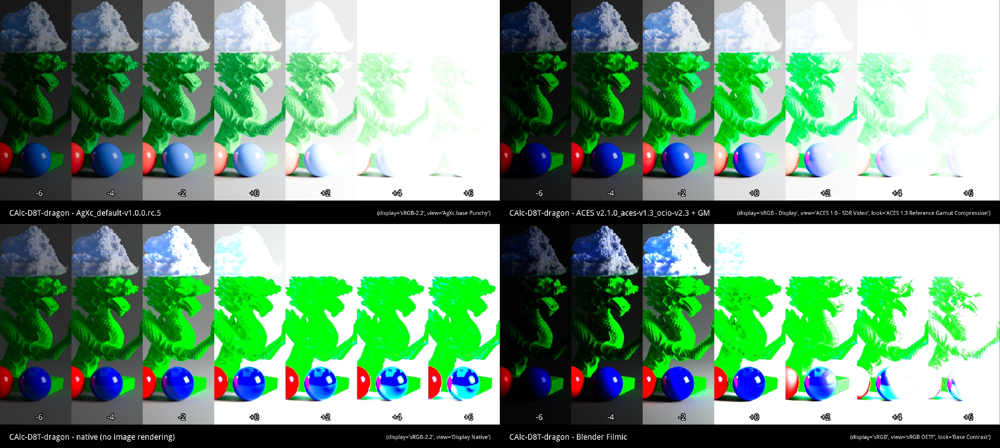

# OCIO

The initial goal was making [the Troy proof-of-concept OCIO config](https://github.com/sobotka/AgX) 
more "production-ready" because, well that's a damn solid concept.

Since AgX was first revealed, much have happens and smart people on the internet
have collaborated to work with the initial concept to improve it, following
Troy guidelines.

The config from the v1.0.0 version now offer a new look based on those research.

## prerequisites

- The config can be used with any DCC supporting OpenColorIO
- The config is compatible with OCIO v2 and OCIO v1 depending on its variant.

I do not guarantee the config to perfectly works on OCIO v1 GPU engine
(due to _allocation vars_ mechanism being tricky to configure).

## content

The OCIO config is based around a linear BT.2020 reference colorspace which also
act as working colorspace.

The config offers support for 3 type of **SDR** display:
- sRGB (2.2 power function and piecewise variants)
- BT.1886 (also known as Rec.709)
- DisplayP3 (Apple devices)

You have 6 variants available depending on your needs:

- [`AgXc_default_OCIO-v1`](AgXc_default_OCIO-v1)
  - compatible with OCIOv1+  
  - minimal configuration
- [`AgXc_default_OCIO-v2`](AgXc_default_OCIO-v2)
  - compatible with OCIOv2+ and include new feature of OCIOv2 
  - minimal configuration
- [`AgXc_all-dccs_OCIO-v1`](AgXc_all-dccs_OCIO-v1)
  - compatible with OCIOv1+     
  - try to offer support for all DCCs at once (makes it a bit messier)
- [`AgXc_all-dccs_OCIO-v2`](AgXc_all-dccs_OCIO-v2)
  - compatible with OCIOv2+ and include new feature of OCIOv2 
  - try to offer support for all DCCs at once (makes it a bit messier)
- [`AgXc_blender_OCIO-v2`](AgXc_blender_OCIO-v2)
  - compatible with OCIOv2+ and include new feature of OCIOv2 
  - offer support for at least Blender
- [`AgXc_redshift_OCIO-v2`](AgXc_redshift_OCIO-v2)
  - compatible with OCIOv2+ and include new feature of OCIOv2 
  - offer support for at least Redshift

If that is not clear, uses the _"all"_ variant if you tend to set the OCIO variable 
once for all your DCC (ex: system environment variable). The other variants are
useful if you are granular when setting environment variables and you are using
custom launcher for every DCC. In that case use the config matching your DCC or
use the _"default"_ one if your dcc is not listed.

You are guaranteed that colorspace name will not change between variants so you
are supposed to be able to arbitrarly swap them without issues.

### looks

The config still offer the initial "Punchy" looks which basically offer a first
grade pass over the very flat AgXc base. However please note an important distinction
is that Punchy is applied AFTER the image-rendering transform. This is the opposite
of the OCIO design which will apply the look BEFORE the View-transform.
So if your DCC offer a "Look" option (like Blender), keep in mind that using 
it will NOT have the same look as the one in "Image Rendering ..." colorspace.

## implementation design

Here is the design of the image rendering transform, called "AgXc":

- assume a linear BT.2020 working colorspace
- use a first gamut "inset" to "undo" the CIE math, with a rotation flourish
- use a "luminance compensation" algorithm (probably not a good name) to sanitize data further
- apply the second gamut "inset" with a rotation flourish.
  This prepare data to behave properly with the per-channel behavior of the tonescale.
- convert to log encoding
- apply tonescale (S-Curve)
- apply outset, the invert of the second inset, but with inverting the rotation.
  This restore chroma but preserve bleaching of highlights to white.
- apply a working colorspace > sRGB conversion. The ouput is still considered
  to be encoded in the working colorspace but that help restore chroma too.

As you can notice in the explanations the improvement over the initial AgX
concept are pretty wacky. Nothing scientific. I don't know why it works but so
far it seems to hold up pretty well.

For the `Punchy` look:

- most importantly the looks is applied AFTER image-rendering, but BEFORE display-transform.
- Punchy increase saturation using the "max" operation to calculate luminance, NOT the usual weights.

## differences with original

Note the config has evolved a lto since the initial fork and the following list
does not fully reflect the differences but might be useful for people used
to the original AgX config.

- Slight update in the colorspaces names / families 
    - `Generic Data` -> `Passthrough` ( for scalar data)
    - `Linear BT.709` -> `sRGB-linear` (less accurate, but clearer for artists)
    - Appearance view renamed.
- punchy look less punchy (tweak it to your taste anyway)
- Edited display's views :
    - New view `Disabled`, data directly to the display.
    - Removed Golden appearance.
- New `ACEScg`, `ACES2065-1` colorspace.
- New `CIE-XYZ-D65` colorspace.
- New `BT.2020-linear` colorspace.
- **OCIO v1 supports**
    - converted OCIO v2 transforms to v1
    - added allocation vars (not 100% accuracy guarantee)

## development

The config is now generated from a python script that can be found in 
[../.dev/implementations/ocio](../.dev/implementations/ocio). Refer to that
build script for details about why and how the config is built that way.