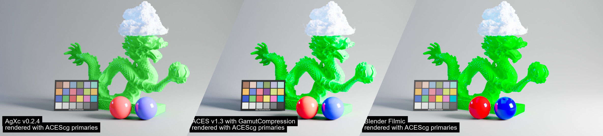

# OCIO

The initial goal was making [the Troy proof-of-concept OCIO config](https://github.com/sobotka/AgX) 
more "production-ready" because, well that's a damn solid concept.

>  [!TIP]
>  Compatible with OCIO v2 and OCIO v1.

## Changes with original

- Slight update in the colorspaces names / families 
    - `Generic Data` -> `Passtrough` ( for scalar data)
    - `Linear BT.709` -> `Linear sRGB` (less accurate, but clearer for artists)
    - Appearance view renamed.
- punchy look less punchy (tweak it to your taste anyway)
- Edited display's views :
    - New view `Disabled`, data directly to the display.
    - Removed Golden appearance.
    - Making `Agx Punchy` the default view
- New `ACEScg`, `ACES2065-1` colorspace.
- New `CIE - XYZ -D65`
- **OCIO v1 supports**
    - converted OCIO v2 transforms to v1
    - added allocation vars (not 100% accuracy guarantee)

## Support

This was tested on :
- RV (no exact version, tested q1 2022)
- Katana (4.0)
- Nuke (13)
- C4D (2023) + Redshift (3.5.07)

I do not guarantee it is perfectly working on OCIO v1 GPU engine.

## Development

The config is now generated from a python script that can be found in 
[../.dev/implementations/ocio](../.dev/implementations/ocio). Refer to that
build script for details about why and how the config is built that way.